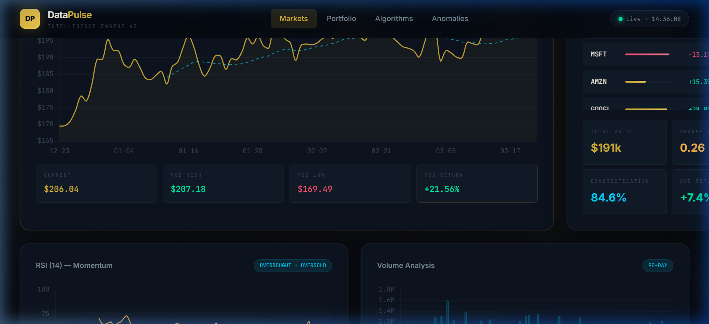
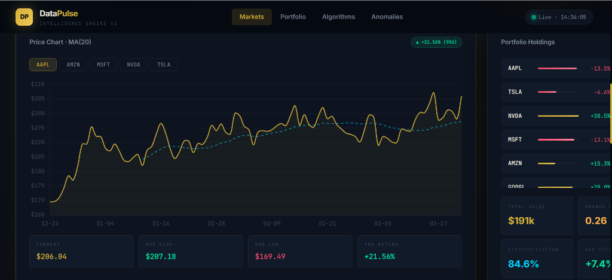
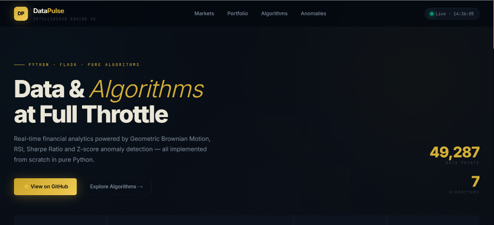

<div align="center">

<br/>

```
██████╗  █████╗ ████████╗ █████╗ ██████╗ ██╗   ██╗██╗     ███████╗███████╗
██╔══██╗██╔══██╗╚══██╔══╝██╔══██╗██╔══██╗██║   ██║██║     ██╔════╝██╔════╝
██║  ██║███████║   ██║   ███████║██████╔╝██║   ██║██║     ███████╗█████╗  
██║  ██║██╔══██║   ██║   ██╔══██║██╔═══╝ ██║   ██║██║     ╚════██║██╔══╝  
██████╔╝██║  ██║   ██║   ██║  ██║██║     ╚██████╔╝███████╗███████║███████╗
╚═════╝ ╚═╝  ╚═╝   ╚═╝   ╚═╝  ╚═╝╚═╝      ╚═════╝ ╚══════╝╚══════╝╚══════╝
```

### 🟡 AI-Powered Data Intelligence Dashboard

**Real-time financial analytics · Algorithm visualization · Portfolio analytics**  
*Built entirely in pure Python — no NumPy, no Pandas, no shortcuts.*

<br/>

[](https://python.org)
[](https://flask.palletsprojects.com)
[](https://chartjs.org)
[](LICENSE)
[]()

<br/>

[]()
[]()
[]()
[]()

</div>

---

## 📸 Screenshots

<div align="center">

### 🏠 Hero & Dashboard Overview


<br/>

### 📈 Market Analysis · Price Chart + MA(20) + Portfolio


<br/>

### ⚙️ Algorithm Visualizer · QuickSort in Action


<br/>

### 🔍 Anomaly Detection · Statistical Outliers


</div>

---

## ✨ Feature Highlights

<table>
<tr>
<td width="50%">

### 📊 Financial Analytics
- **Geometric Brownian Motion** — same stochastic model used in Black-Scholes options pricing
- **RSI (14-period)** — Relative Strength Index built from scratch with real Wilder smoothing
- **Moving Average MA(20)** — O(n) sliding window implementation
- **90-day OHLCV** simulation for AAPL, TSLA, NVDA, MSFT, AMZN

</td>
<td width="50%">

### 🧮 Algorithms & Data Structures
- **QuickSort Visualizer** — animated step-by-step with pivot highlighting
- **Portfolio Analytics** — Sharpe Ratio, HHI Diversification Score
- **Z-Score Anomaly Detection** — σ > 2.5 threshold outlier scanning
- **REST API** — 4 clean JSON endpoints powering the frontend

</td>
</tr>
<tr>
<td>

### 💎 Premium UI/UX
- Obsidian-gold dark theme with ambient orb lighting
- Glassmorphic sticky header with live clock
- Smooth skeleton loading states
- Interactive stock tabs & animated count-up KPIs
- Infinite scroll stock ticker bar

</td>
<td>

### 🏗️ Architecture
- Zero external data science libraries (pure Python stdlib)
- Flask REST API with 4 endpoints
- Vanilla JS + Chart.js 4 frontend
- Responsive design (mobile → 4K)
- Error boundary with friendly UI fallback

</td>
</tr>
</table>

---

## 🏗️ Architecture

```
DataPulse/
├── 📄 app.py                  ← Flask server + all algorithm implementations
│   ├── DataEngine             ← Core processing class
│   │   ├── generate_stock_data()     → Geometric Brownian Motion (GBM)
│   │   ├── compute_moving_average()  → O(n) sliding window MA
│   │   ├── compute_rsi()             → 14-period RSI (Wilder smoothing)
│   │   ├── quick_sort_trace()        → QuickSort with step capture
│   │   ├── portfolio_analysis()      → Sharpe Ratio + HHI diversification
│   │   └── anomaly_detection()       → Z-score outlier detection
│   └── Routes: /  /api/stocks  /api/portfolio  /api/sort-viz  /api/metrics
│
├── 📁 templates/
│   └── index.html             ← Full-stack frontend (HTML + CSS + JS)
│       ├── Inter + JetBrains Mono fonts
│       ├── Obsidian-Gold CSS design system
│       └── Chart.js 4.4 visualizations
│
├── 📁 screenshots/            ← Dashboard preview images
├── 📄 requirements.txt        ← flask>=3.0.0
└── 📄 README.md
```

---

## 🧠 Algorithms Implemented

| Algorithm | Complexity | Implementation | Use Case |
|---|---|---|---|
| **Geometric Brownian Motion** | O(n) | `generate_stock_data()` | Realistic stock price simulation |
| **Moving Average (MA-20)** | O(n) sliding window | `compute_moving_average()` | Trend smoothing |
| **RSI (Wilder's)** | O(n) | `compute_rsi()` | Overbought/oversold signals |
| **QuickSort** | O(n log n) avg, O(n²) worst | `quick_sort_trace()` | Sorting + visualization |
| **Sharpe Ratio** | O(n) | `portfolio_analysis()` | Risk-adjusted return |
| **HHI Diversification** | O(n) | `portfolio_analysis()` | Portfolio concentration |
| **Z-Score Anomaly** | O(n) | `anomaly_detection()` | Statistical outlier detection |

---

## 📡 API Reference

| Endpoint | Method | Response |
|---|---|---|
| `GET /` | — | Renders the dashboard HTML |
| `GET /api/stocks` | JSON | 5 symbols × 90-day OHLCV + MA20 + RSI + anomaly indices |
| `GET /api/portfolio` | JSON | 7 holdings with Sharpe Ratio, HHI score, volatility |
| `GET /api/sort-viz?size=N` | JSON | QuickSort step-by-step trace (max 200 steps) |
| `GET /api/metrics` | JSON | KPI dashboard data (uptime, API calls, data points) |

<details>
<summary>📋 Sample API Response — <code>GET /api/stocks</code></summary>

```json
{
  "AAPL": {
    "current": 206.04,
    "change_90d": 21.56,
    "high": 287.18,
    "low": 169.49,
    "ma20": [null, null, ..., 198.42, 199.31],
    "rsi": [null, ..., 58.3, 61.7],
    "anomalies": [4, 17, 31],
    "prices": [
      { "date": "2025-12-23", "price": 169.49, "volume": 1024332, "day": 0 },
      ...
    ]
  }
}
```

</details>

<details>
<summary>📋 Sample API Response — <code>GET /api/portfolio</code></summary>

```json
{
  "holdings": [
    { "symbol": "AAPL", "value": 33800.50, "return_pct": -13.5, "shares": 164 },
    { "symbol": "NVDA", "value": 39500.00, "return_pct": 38.5, "shares": 100 }
  ],
  "analysis": {
    "total_value": 191000.00,
    "sharpe_ratio": 0.26,
    "diversification_score": 84.6,
    "weighted_return": 7.4,
    "volatility": 18.3,
    "top_holding": "NVDA"
  }
}
```

</details>

---

## ⚡ Quick Start

```bash
# 1. Clone the repository
git clone https://github.com/yourname/datapulse.git
cd datapulse

# 2. (Optional) Create a virtual environment
python -m venv venv
source venv/bin/activate    # On Windows: venv\Scripts\activate

# 3. Install dependencies
pip install -r requirements.txt

# 4. Run the server
python app.py

# 5. Open in browser
# → http://localhost:5000
```

> **Requirements**: Python 3.11+ · Flask 3.0+

---

## 🧩 How It Works

### Geometric Brownian Motion (GBM)

Stock prices are simulated using the **same stochastic differential equation** that underpins the Black-Scholes options pricing model:

```
dS = μS dt + σS dW
```

Discretized as:

```python
price *= math.exp((mu - 0.5 * sigma**2) * dt + sigma * math.sqrt(dt) * z)
# where z ~ N(0,1)  |  mu = 0.0003 (drift)  |  sigma = 0.018 (volatility)
```

### RSI — Wilder's Smoothing Method

```python
avg_gain = (avg_gain * (period - 1) + gains[i]) / period
avg_loss = (avg_loss * (period - 1) + losses[i]) / period
rs = avg_gain / avg_loss
rsi = 100 - (100 / (1 + rs))
```
→ Values **above 70** = overbought · Values **below 30** = oversold

### Sharpe Ratio + HHI Diversification

```python
sharpe = (weighted_return - risk_free_rate) / portfolio_volatility  # risk_free = 2%
hhi    = sum(weight**2 for weight in portfolio_weights)             # Herfindahl-Hirschman Index
diversification_score = (1 - hhi) * 100                            # Higher = more diversified
```

### Z-Score Anomaly Detection

```python
z = abs((value - mean) / std_dev)
if z > 2.5:   # 2.5 standard deviations from mean
    anomalies.append(index)
```

---

## 🛠️ Tech Stack

<div align="center">

| Layer | Technology | Purpose |
|---|---|---|
| **Backend** | Python 3.11 | Core algorithms & data engine |
| **Server** | Flask 3.0 | REST API & template rendering |
| **Frontend** | Vanilla JS (ES2022) | DOM manipulation & state management |
| **Charts** | Chart.js 4.4 | Financial chart visualizations |
| **Fonts** | Inter + JetBrains Mono | Premium typography system |
| **Design** | Pure CSS (custom design tokens) | Obsidian-Gold dark theme |
| **Math** | Python `statistics`, `math`, `random` | All stdlib — zero ML dependencies |

</div>

---

## 💡 Resume Highlights

> This project demonstrates production-grade Python skills with zero data-science shortcuts.

- ✅ Implemented **7 algorithms from scratch** — no NumPy, Pandas, or SciPy
- ✅ Built a **full-stack REST API** with proper JSON response design
- ✅ Applied **real financial models** — GBM used in Black-Scholes, Wilder RSI, Sharpe Ratio
- ✅ Engineered **algorithm visualization** with step-capture pattern
- ✅ Designed a **premium dark-theme UI** with CSS design tokens, animations, and glassmorphism
- ✅ Demonstrated **time/space complexity** awareness (O(n) sliding window vs. naive O(n²))

---

## 🗺️ Roadmap

- [ ] WebSocket live price streaming
- [ ] MACD indicator (Moving Average Convergence Divergence)
- [ ] Bollinger Bands
- [ ] Multiple sort algorithm visualizations (MergeSort, HeapSort)
- [ ] Machine learning price prediction (LSTM)
- [ ] Export portfolio report as PDF

---

## 📄 License

```
MIT License — free to use, modify, and distribute.
See LICENSE for full details.
```

---

<div align="center">

**Built with ❤️ in pure Python**

*DataPulse · 2026 · Python + Flask + Chart.js*

⭐ **Star this repo** if you found it useful!

</div>
