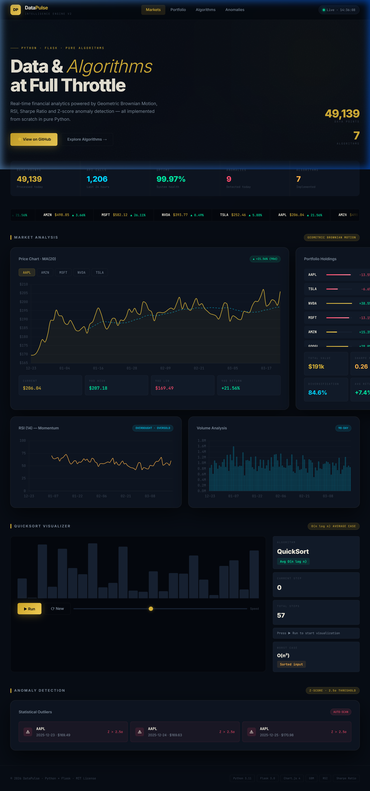
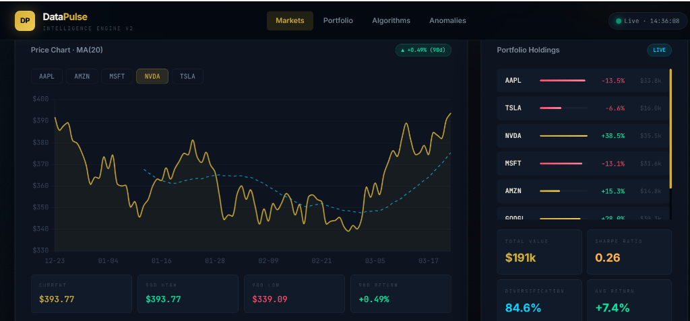
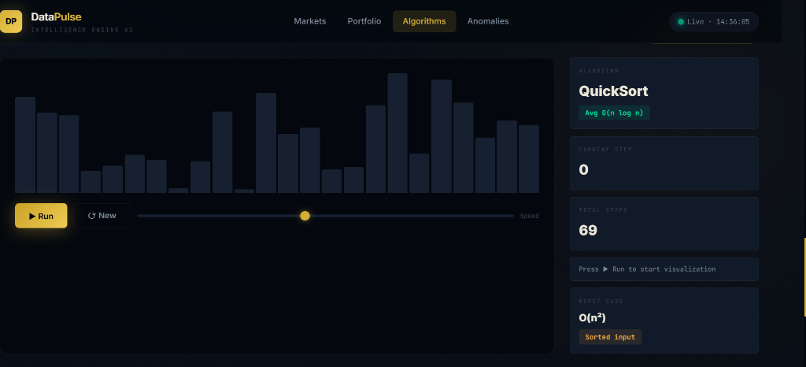

<div align="center">

<br/>

```
██████╗  █████╗ ████████╗ █████╗ ██████╗ ██╗   ██╗██╗     ███████╗███████╗
██╔══██╗██╔══██╗╚══██╔══╝██╔══██╗██╔══██╗██║   ██║██║     ██╔════╝██╔════╝
██║  ██║███████║   ██║   ███████║██████╔╝██║   ██║██║     ███████╗█████╗  
██║  ██║██╔══██║   ██║   ██╔══██║██╔═══╝ ██║   ██║██║     ╚════██║██╔══╝  
██████╔╝██║  ██║   ██║   ██║  ██║██║     ╚██████╔╝███████╗███████║███████╗
╚═════╝ ╚═╝  ╚═╝   ╚═╝   ╚═╝  ╚═╝╚═╝      ╚═════╝ ╚══════╝╚══════╝╚══════╝
```

### 🟡 AI-Powered Data Intelligence Dashboard

**Real-time financial analytics · Algorithm visualization · Portfolio analytics**  
*Built entirely in pure Python — no NumPy, no Pandas, no shortcuts.*

<br/>

[](https://python.org)
[](https://flask.palletsprojects.com)
[](https://chartjs.org)
[](LICENSE)
[]()

<br/>

[]()
[]()
[]()
[]()

</div>

---

## 📸 Screenshots

<div align="center">

### 🏠 Full Dashboard — Hero + KPIs + Ticker


<br/>

### 📈 Market Analysis — Price Chart · MA(20) · Portfolio Holdings


<br/>

### 📊 Market Deep Dive — NVDA · 90-Day Price + Portfolio Metrics


<br/>

### ⚙️ QuickSort Visualizer — Live Algorithm Animation


</div>

---

## ✨ Feature Highlights

<table>
<tr>
<td width="50%">

### 📊 Financial Analytics
- **Geometric Brownian Motion** — same stochastic model used in Black-Scholes options pricing
- **RSI (14-period)** — Relative Strength Index with real Wilder smoothing
- **Moving Average MA(20)** — O(n) sliding window implementation
- **90-day OHLCV** simulation for AAPL, TSLA, NVDA, MSFT, AMZN

</td>
<td width="50%">

### 🧮 Algorithms & Data Structures
- **QuickSort Visualizer** — animated step-by-step with pivot highlighting (gold) and comparison (cyan)
- **Portfolio Analytics** — Sharpe Ratio, HHI Diversification Score
- **Z-Score Anomaly Detection** — σ > 2.5 threshold outlier scanning
- **REST API** — 4 clean JSON endpoints powering the entire frontend

</td>
</tr>
<tr>
<td>

### 💎 Premium UI/UX
- Obsidian-gold dark theme with triple ambient orb lighting
- Glassmorphic sticky header with live timestamp
- Shimmer skeleton loading states
- Animated KPI count-up on load
- Infinite scroll stock ticker bar with fade edges
- Error boundary with friendly UI fallback

</td>
<td>

### 🏗️ Architecture
- **Zero** external data science libraries (pure Python stdlib)
- Flask REST API with 4 endpoints
- Vanilla JS + Chart.js 4 frontend
- RSI overbought/oversold lines drawn via Chart.js `afterDraw`
- Responsive: mobile → ultrawide 4K
- Git-tracked screenshots folder

</td>
</tr>
</table>

---

## 🏗️ Project Structure

```
datapulse/
├── 📄 app.py                        ← Flask server + all algorithm implementations
│   └── class DataEngine
│       ├── generate_stock_data()    → Geometric Brownian Motion
│       ├── compute_moving_average() → O(n) sliding window MA-20
│       ├── compute_rsi()            → 14-period RSI (Wilder smoothing)
│       ├── quick_sort_trace()       → QuickSort with full step capture
│       ├── portfolio_analysis()     → Sharpe Ratio + HHI diversification
│       └── anomaly_detection()      → Z-score (threshold: 2.5σ)
│
├── 📁 templates/
│   └── index.html                   ← Full-stack frontend (HTML + CSS + JS)
│
├── 📁 screenshots/                  ← Dashboard preview images (committed to repo)
│   ├── hero.png                     → Full dashboard overview
│   ├── aapl_chart.png               → AAPL market analysis
│   ├── nvda_chart.png               → NVDA market analysis
│   └── sort.png                     → QuickSort visualizer
│
├── 📄 requirements.txt              ← flask>=3.0.0
└── 📄 README.md
```

---

## 🧠 Algorithms Implemented

| Algorithm | Time Complexity | Method | Use Case |
|---|---|---|---|
| **Geometric Brownian Motion** | O(n) | `generate_stock_data()` | Realistic stock price simulation |
| **Moving Average (MA-20)** | O(n) sliding window | `compute_moving_average()` | Trend smoothing |
| **RSI — Wilder's Method** | O(n) | `compute_rsi()` | Overbought / oversold signals |
| **QuickSort** | O(n log n) avg · O(n²) worst | `quick_sort_trace()` | Sorting + live visualization |
| **Sharpe Ratio** | O(n) | `portfolio_analysis()` | Risk-adjusted return metric |
| **HHI Diversification Index** | O(n) | `portfolio_analysis()` | Portfolio concentration score |
| **Z-Score Anomaly Detection** | O(n) | `anomaly_detection()` | Statistical outlier detection |

---

## 📡 API Reference

| Endpoint | Method | Description |
|---|---|---|
| `GET /` | — | Renders the dashboard HTML page |
| `GET /api/stocks` | JSON | 5 symbols × 90-day OHLCV + MA20 + RSI + anomaly indices |
| `GET /api/portfolio` | JSON | 7 holdings with Sharpe Ratio, HHI, volatility |
| `GET /api/sort-viz?size=N` | JSON | QuickSort step-by-step trace (capped at 200 steps) |
| `GET /api/metrics` | JSON | Dashboard KPI data (uptime, API calls, data points) |

<details>
<summary>📋 Sample — <code>GET /api/stocks</code></summary>

```json
{
  "AAPL": {
    "current": 206.04,
    "change_90d": 21.56,
    "high": 287.18,
    "low": 169.49,
    "ma20": [null, null, "...", 198.42, 199.31],
    "rsi":  [null, "...", 58.3, 61.7],
    "anomalies": [4, 17, 31],
    "prices": [
      { "date": "2025-12-23", "price": 169.49, "volume": 1024332, "day": 0 }
    ]
  }
}
```

</details>

<details>
<summary>📋 Sample — <code>GET /api/portfolio</code></summary>

```json
{
  "holdings": [
    { "symbol": "AAPL", "value": 33800.50, "return_pct": -13.5, "shares": 164 },
    { "symbol": "NVDA", "value": 39500.00, "return_pct": 38.5,  "shares": 100 }
  ],
  "analysis": {
    "total_value": 191000.00,
    "sharpe_ratio": 0.26,
    "diversification_score": 84.6,
    "weighted_return": 7.4,
    "volatility": 18.3,
    "top_holding": "NVDA"
  }
}
```

</details>

---

## ⚡ Quick Start

```bash
# 1. Clone the repository
git clone https://github.com/yourname/datapulse.git
cd datapulse

# 2. (Optional) Create a virtual environment
python -m venv venv
source venv/bin/activate     # Windows: venv\Scripts\activate

# 3. Install dependencies
pip install -r requirements.txt

# 4. Run the development server
python app.py

# 5. Open in your browser
#    → http://localhost:5000
```

> **Requirements:** Python 3.11+ · Flask 3.0+

---

## 🧩 How The Algorithms Work

### Geometric Brownian Motion (GBM)
Uses the same stochastic differential equation that underpins Black-Scholes options pricing:
```
dS = μS dt + σS dW
```
Discretized form implemented in Python:
```python
price *= math.exp((mu - 0.5 * sigma**2) * dt + sigma * math.sqrt(dt) * z)
# z ~ N(0,1)  |  mu = 0.0003 (drift)  |  sigma = 0.018 (volatility)
```

### RSI — Wilder's Smoothing
```python
avg_gain = (avg_gain * (period - 1) + gains[i]) / period
avg_loss = (avg_loss * (period - 1) + losses[i]) / period
rsi = 100 - (100 / (1 + avg_gain / avg_loss))
# > 70 = Overbought  |  < 30 = Oversold
```

### Sharpe Ratio + HHI Diversification
```python
sharpe = (weighted_return - 2.0) / portfolio_volatility      # risk-free rate = 2%
hhi    = sum(weight**2 for weight in portfolio_weights)       # Herfindahl-Hirschman Index
diversification = (1 - hhi) * 100                            # Higher = more diversified
```

### Z-Score Anomaly Detection
```python
z_score = abs((value - mean) / std_dev)
if z_score > 2.5:    # 2.5 standard deviations = ~1.2% of data flagged
    anomalies.append(index)
```

---

## 🛠️ Tech Stack

<div align="center">

| Layer | Technology | Version | Purpose |
|---|---|---|---|
| **Backend** | Python | 3.11+ | Core algorithm engine |
| **Web Server** | Flask | 3.0 | REST API + HTML rendering |
| **Frontend JS** | Vanilla ES2022 | — | DOM, state, fetch |
| **Charts** | Chart.js | 4.4 | Financial visualization |
| **Fonts** | Inter + JetBrains Mono | — | Premium typography |
| **Styling** | Pure CSS (design tokens) | — | Obsidian-Gold dark theme |
| **Data/Math** | Python stdlib | — | statistics, math, random |

</div>

---

## 💡 Resume Highlights

> This project proves production-level Python skills with **zero data-science shortcuts**.

- ✅ Implemented **7 algorithms from scratch** — no NumPy, Pandas, or SciPy at all
- ✅ Built a **full-stack REST API** with proper JSON contract design (4 endpoints)
- ✅ Applied **real financial models** — GBM (Black-Scholes adjacent), Wilder RSI, Sharpe Ratio
- ✅ Engineered **step-capture algorithm visualization** (QuickSort with pivot tracing)
- ✅ Designed a **production-grade dark UI** with CSS design tokens, animations, glassmorphism
- ✅ Demonstrated **time/space complexity** awareness (O(n) sliding window vs. naive O(n²))
- ✅ Implemented **error boundaries** with graceful UI fallback for API failures

---

## 🗺️ Roadmap

- [ ] WebSocket live price streaming
- [ ] MACD (Moving Average Convergence Divergence)
- [ ] Bollinger Bands overlay on price chart
- [ ] Multiple sort algorithms (MergeSort, HeapSort, BubbleSort)
- [ ] LSTM neural network price prediction
- [ ] Download portfolio report as PDF

---

## 📄 License

```
MIT License — free to use, modify, and distribute.
```

---

<div align="center">

**Built with ❤️ in pure Python — no shortcuts taken**

*DataPulse · 2026 · Python + Flask + Chart.js*

⭐ **Star this repo** if you found it useful — it helps others discover it!

</div>
